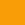
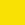
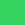
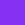

# Letter-Recognition

Generate images with the specified group of characters.

| Argument | Description | Default Value | Required |
| -------- | ----------- | :-----------: | :------: |
| `--dimensions`, `-d` | Dimensions for the images | `[1920, 1080]` | ✖️ |
| `--font-path`, `-fp` | Path to font | `None` | ✖️ |
| `--bgcolor`, `-bg` | Background Color | `[255, 255, 255]` | ✖️ |
| `--fgcolor`, `-fg` | Foreground Color | `[0, 0, 0]` | ✖️ |
| `--uppercase`, `-u` | include the uppercase letter | `False` | ✖️ |
| `--lowercase`, `-l` | include the lowercase letter | `False` | ✖️ |
| `--numbers`, `-n` | include the numbers 0-9 | `False` | ✖️ |
| `--font-size`, `-fs` | font-size for each character | `900` | ✖️ |
| `--character-set`, `-cs` | custom character set| `None` | ✖️ |

### Options for Colors:

| Color | RGB | Swatch   |
| ----- | :-: | :------: |
| Blue  |55 182 246 |  |
| Orange | 249 157 7 |  |
| Yellow | 249 225 4 |  |
| Green | 53 212 97 |  |
| Purple | 136 47 246 |  |